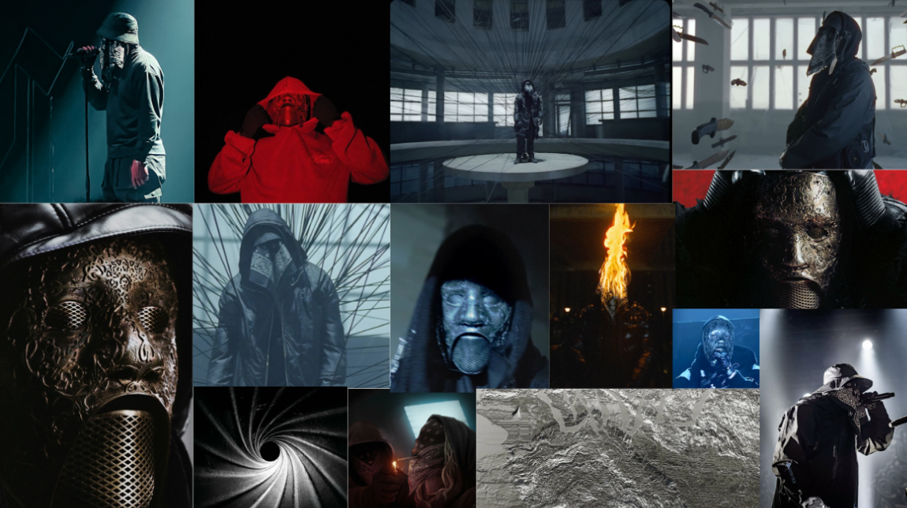

# Creative Develpoment — Ziak

## Concept

Site web pour le prochain album de Ziak. L'expérience combine tracklist interactive et générateur de covers personnalisées, reflétant l'univers sombre et brut du rappeur. Chaque élément visuel du dithering granuleux aux animations capture l'intensité et l'authenticité qui caractérisent l'identité artistique de Ziak.

## Choix Graphiques

**Dithering** — Texture granuleuse qui évoque l'esthétique l'authenticité du rap, créant une identité visuelle unique et reconnaissable de Ziak

**Monochrome** — Contraste noir et blanc radical qui reflète la dualité et l'intensité de l'univers de Ziak

## Aperçu



## Démarrage

```bash
# Installation
npm install
# ou
bun install

# Développement
npm run dev
# ou
bun run dev
```

Accessible sur `http://localhost:5173`
Ou sur `https://iimb3-creative-developement.vercel.app/`


Fait pas Julien Menet et Noa Obringer   